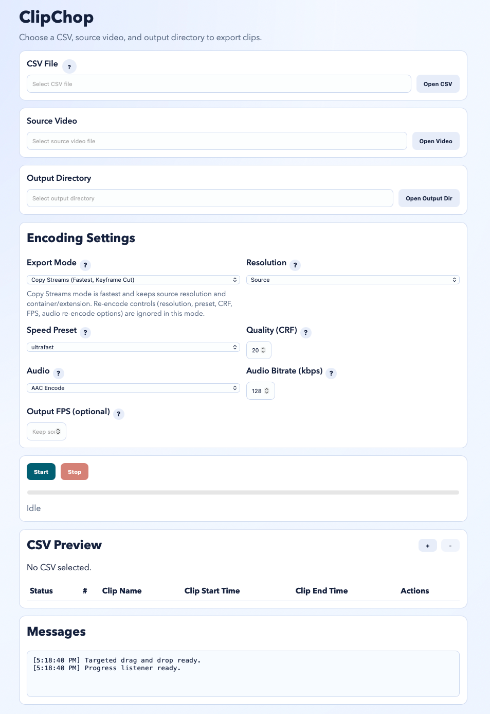
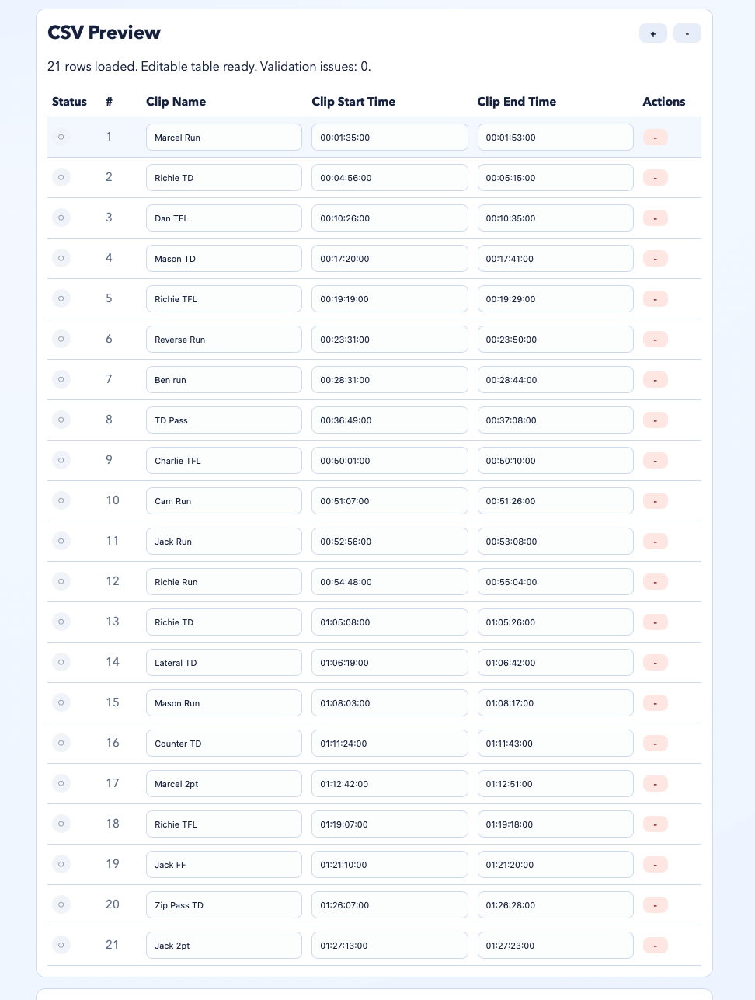
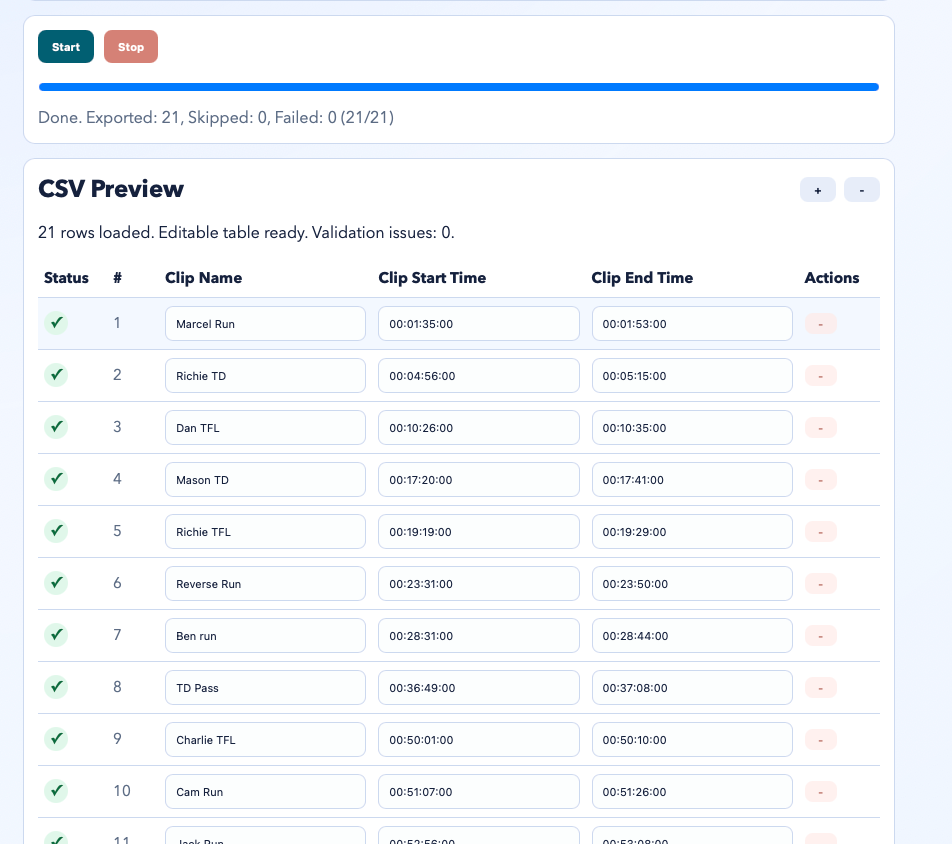

<p align="center">
  
</p>

# ClipChop

As a football coach, I’m constantly digging through hour-long game footage to clip out stuff for other projects. Whether it’s highlights or lowlights, I usually jot down timestamps and a quick label for each moment. Then I’d open Adobe Premiere, Final Cut Pro, or DaVinci and clip everything by hand, which could take forever and was easy to mess up.

So I figured: why not automate this? That’s exactly what ClipChop does. Give it a CSV with your clip times, point it at your source video, pick an output folder, and it handles the rest.  

Batch video clip extractor — chop videos into clips using CSV timecodes and `ffmpeg`.

## Download & Install

Head over to the [Releases](../../releases) page and grab the latest installer for your OS:

| Platform              | File            |
|-----------------------|-----------------|
| macOS (Apple Silicon) | `.dmg`          |
| macOS (Intel)         | `.dmg`          |
| Windows               | `.exe` / `.msi` |
| Linux                 | `.deb` / `.AppImage` |

Just download, install, and run. The only extra thing you'll need is **[ffmpeg](https://ffmpeg.org/download.html)** installed on your machine — ClipChop uses it under the hood to do the actual cutting.

## Screenshots







## Features

- Open CSV file
- Open source video file
- Open output directory
- Start and stop export
- Progress updates
- CSV preview with inline editable rows (name/start/end)
- Add/remove rows in the editable list (`+` / `-`)
- Per-row status markers during export (pending/running/complete/failed)
- CSV format help in-app
- Tweakable encoding settings:
  - Export mode:
    - `Re-encode (Precise Cut, Current)`
    - `Copy Streams (Fastest, Keyframe Cut)`
    - `Re-encode (Fast Seek)`
  - Resolution (`source`, `1080p`, `720p`, `480p`)
  - H.264 speed preset (`ultrafast` to `medium`)
  - CRF quality level
  - Audio mode (`AAC`, `copy`, `none`) and AAC bitrate
  - Optional output FPS

## CSV Columns

The app accepts these column aliases:

- Clip Name: `clip name`, `name`, `clip`
- Clip Start Time: `clip start time`, `start time`, `start`, `in`
- Clip End Time: `clip end time`, `end time`, `end`, `out`

## Time Formats

- `HH:MM:SS:FF` (assumes 30 fps)
- `HH:MM:SS`
- `MM:SS`
- raw seconds (e.g. `92.5`)

## Creating the CSV from a Spreadsheet

If you’d rather build your clip list in a spreadsheet first (great for game notes), this is the easiest workflow.

1. Create 3 columns with headers:
   - `clip name`
   - `start`
   - `end`
2. Fill in one clip per row.
3. Use any of the supported time formats above for `start` and `end`.
4. Export/download as `.csv`.
5. Load that CSV into ClipChop.

Example:

```csv
clip name,start,end
Kickoff return,00:01:22,00:01:34
3rd down sack,00:12:05,00:12:12
Red zone pass breakup,00:23:40,00:23:47
```

Google Sheets:
- `File -> Download -> Comma Separated Values (.csv)`

Microsoft Excel:
- `File -> Save As` (or `Export`) -> `CSV UTF-8 (Comma delimited) (*.csv)`

Tip: Keep row 1 as headers and avoid blank rows in the middle of your data.

---

## Development

### Prerequisites

- Rust toolchain (includes `cargo`)
- Tauri CLI
- `ffmpeg` installed and available on `PATH`

### Local Run

From `src-tauri`:

```bash
cargo tauri dev
```

### Build Installer / Binary

From `src-tauri`:

```bash
cargo tauri build
```

Generated app installers/binaries are placed under `src-tauri/target/release/bundle/`.

If DMG packaging fails in your environment, you can still build a runnable macOS app bundle:

```bash
cargo tauri build --debug --bundles app
```

Output:
`src-tauri/target/debug/bundle/macos/ClipChop.app`

### Notes

- This project uses a static frontend in `src` (no Node bundler required).
- Build per platform on that platform (or use CI runners for each OS target).

### Pre-commit

This repo includes a pre-commit config at the repository root.

From the repo root:

```bash
pre-commit install
pre-commit run --all-files
```

Configured checks include:
- whitespace / YAML / merge-conflict safety hooks
- `cargo fmt --check` for `src-tauri`
- `cargo check` for `src-tauri`
